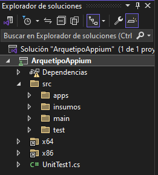
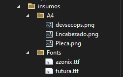
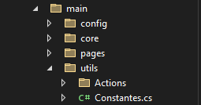
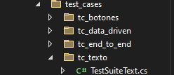

# Arquetipo Appium 

- Este repositorio cuenta con un arquetipo el cual está customizado para la generación de scripts automatizados basados en Appium, Csharp y NUnit como Framework de Testing. La estructura aquí presentada está diseñada con el objetivo de estandarizar la generación y mantenimiento del script automatizado basado en buenas practicas que dicta la industria.

## INDICE

1. [Instalación](#Instalación)
2. [Uso](#Uso)
3. [Configuracion](#Configuracion)
4. [Contribución](#Contribución)
5. [Créditos](#Créditos)
6. [Licencia](#Licencia)
7. [Contacto](#Contacto)

## Instalación 

Para implementar el arquetipo se necesitas seguir los siguientes pasos:

 1. Ingresar a la URL: https://github.com/Axitymx/24_AXITY_AR33_A_ALMACH_APPIUM_C-
 2. Ingresar a la sección Code (Seleccionar alguna de las opciones para clonar el repositorio de manera local)
      - **Utilizando la URL**: https://github.com/Axitymx/24_AXITY_AR33_A_ALMACH_APPIUM_C-.git
      - **Utilizando la instrucción** gh repo clone Axitymx/24_AXITY_AR33_A_ALMACH_APPIUM_C- :
      - **Abrirlo con GitHub Desktop**
      - **Abrirlo con Visual Studio**
      - **Descargarlo con ZIP**
 3. Una vez descargada la solución tendremos la siguiente estructura de carpetas:
- **ArquetipoAppium**
  - **.github**
  - **.nuget**
  - **src**
    - **Appium.Net**
    - **TestProject1**
    - **Appium.Net.sln**
  - **test**
     - **integration**
       - **src** 
         - **drivers**
           - **apps**
         - **insumos**
           - **A4**
           - **Fonts**
         - **main**
            - **config**
            - **core**
            - **pages**
            - **utils**
               - **actions**
         - **test**
          - **screenshots**
          - **test_cases**
             - **tc_botones**
             - **tc_data_driven**
             - **tc_end_to_end**
             - **tc_texto**
          - **test_data**
             - **excel**
          - **test_report**
             - **lectura_archivos**
             - **models**
             - **utility**       
        - **bin/Debug/net6.0**
        - **obj**
        - **Debug/net6**
        - **Appium.Net.Integration.Test.csproj**
        

 4. Abrir el archivo ".ArquetipoAppium.sln" en el IDE Microsoft Visual Studio 2022 (Community, Professional o Enterprise).
 5. En la sección de Explorador de Soluciones, se debe seleccionar el archivo raíz Arquetipo Appium
 6. Se debe dar clic derecho y seleccionar la opción Limpiar para prepararla solución para su compilación.
 7. Se debe dar clic derecho y seleccionar la opción Compilar. (Cuando se compila la solución se debe validar que los paquetes Nuget de la sección de Dependencias se hayan descargado de manera satisfactoria). 

## Uso 

1. En la sección de Explorador de Soluciones, encontraremos las siguientes carpetas: 

    - **drivers**
    - **Insumos**
    - **main**
    - **test**

 
   

2. En la carpeta de Apps encontraremos archivos que son las aplicaciones moviles donde se realizarán las pruebas automatizadas.

 

3. En la carpeta Insumos encontraremos dos subcarpetas, la primera A4 en donde están las imágenes correspondientes al layout que utilizará el reporte en su generación y la de Fonts que como su nombre lo dice son las fuentes utilizadas para la generación del reporte.

 

4. En la carpeta de main encontraremos las carpetas:

   - **config**:: Tenemos las clases AppConfig.cs y ServerConfig.cs 
   
     - **La clase AppConfig** se encarga de definir los atributos clave de una aplicación específica que será utilizada para realizar pruebas automatizadas. Estos atributos incluyen el paquete y la actividad principal de la aplicación, así como el nombre del sistema operativo y del dispositivo. Además, proporciona un método para obtener las capacidades necesarias de Appium para automatizar pruebas en dispositivos Android. En conjunto, esta clase sirve como un punto centralizado para configurar los detalles esenciales de la aplicación de prueba, facilitando así el mantenimiento y la reutilización del código en el proceso de automatización de pruebas.
   
     - **La clase ServerConfig** facilita la gestión del servidor de Appium para las pruebas automatizadas. A través de sus métodos, permite obtener la dirección del servidor de Appium, ya sea desde una variable de entorno específica o utilizando una dirección predeterminada. Además, ofrece la capacidad de iniciar un servicio local de Appium en un puerto y dirección IP personalizados, o utilizar valores por defecto. En conjunto, esta clase simplifica la configuración y el inicio del servidor de Appium, proporcionando así una base sólida para la ejecución de pruebas automatizadas en entornos de desarrollo y prueba.

 

   - **core**:: La clase BaseTest.cs, se utiliza como una clase base para las pruebas en el marco de NUnit. Extiende la configuración de la aplicación AppConfig, proporcionando un punto de partida común para todas las pruebas. En el método SetUp, que se ejecuta antes de cada prueba, se configuran y se inician los servicios necesarios para la ejecución de las pruebas, como el servidor de Appium y el controlador de Android. En el método TearDown, que se ejecuta después de cada prueba, se lleva a cabo la limpieza y finalización de las pruebas, cerrando la aplicación bajo prueba y liberando los recursos del controlador de Android. En resumen, la clase BaseTest establece un entorno coherente y automatizado para la ejecución de pruebas en el marco de NUnit, facilitando la gestión de la configuración y limpieza antes y después de cada prueba.

 

   - **pages**:  Son clases de páginas que representan diferentes pantallas o funcionalidades de una aplicación móvil que se está probando utilizando Appium y NUnit. cada clase de página contiene métodos para interactuar con los elementos de la interfaz de usuario en una pantalla específica de la aplicación móvil, lo que permite automatizar las pruebas de manera más eficiente y estructurada. El primer script corresponde a la clase  HomePage, que inicializa la página de inicio de la aplicación y define localizadores para elementos en esta pantalla.El segundo script corresponde a la clase InfoPage, que maneja las interacciones en la página de información de la aplicación, como ingresar un nombre de usuario, seleccionar un género, y elegir un país de una lista desplegable. El tercer script es la clase ProductosPage, que define métodos para buscar y seleccionar productos en la página de productos de la aplicación, así como para acceder al carrito de compras. El cuarto script es la clase ConfirmacionPage, que define métodos para interactuar con elementos de la pantalla de confirmación de la aplicación, como hacer clic en una casilla de verificación y en un botón de confirmación.

 

   - **util**: Cuenta con una clase Constantes.cs la cual es el conjunto de todas las constantes utilizadas en el framework se pueden agregar más si así se requiere. Se tiene un Folder llamado Actions que cuenta con: la clase Accions.cs en el contexto de Appium proporciona una abstracción para realizar acciones comunes en aplicaciones móviles utilizando Appium, lo que permite un código más limpio y mantenible al encapsular la lógica de Appium en métodos reutilizables. Estos métodos pueden incluir acciones como hacer clic en elementos, ingresar texto, deslizar la pantalla, entre otras. Por otro lado, la clase DataHelper.cs facilita la lectura de datos desde un archivo Excel y su utilización como casos de prueba en pruebas automatizadas. Esto es especialmente útil para realizar pruebas con conjuntos de datos variados o pruebas de regresión. Por último, la clase Constantes.cs proporciona un lugar centralizado para definir y acceder a constantes específicas de la aplicación en el contexto de Appium. Esto mejora la legibilidad y mantenibilidad del código al evitar la repetición de valores literales, permitiendo su modificación y consistencia en todo el proyecto de automatización de pruebas móviles. Las constantes definidas aquí pueden ser referenciadas desde otras clases dentro del proyecto de Appium para asegurar una gestión eficiente y consistente de los valores utilizados en la automatización de pruebas.

 

5. En la carpeta de test encontraremos las carpetas:

   - **screenshots**: En esta carpeta encontraremos los screenshot tomados para la generación del reporte

 

   - **test_cases**: Encontraremos 5 carpetas
   
   - **En tc_botones encontraremos**:

       - **La clase TestSuiteBotones.cs** la cual es un conjunto de pruebas destinadas a evaluar la funcionalidad de los botones en la aplicación General Store. Cada método de prueba dentro de esta clase se enfoca en verificar una acción específica relacionada con los botones, como seleccionar el género femenino, hacer clic en el botón "Shop" o desplegar la lista de países. Utilizando Appium y NUnit como herramientas de pruebas, estos métodos inician la aplicación, realizan la acción correspondiente y luego verifican si el resultado es el esperado mediante aserciones.

 
 
   - **En tc_data_driven encontraremos**:

       - **La clase TCDataDriven.cs**: es un ejemplo de caso de prueba que utiliza datos impulsados para probar diferentes nombre de paises en el droplist de la app. Esto permite realizar pruebas exhaustivas con diferentes conjuntos de datos para garantizar que el inicio de sesión funcione correctamente en diversas situaciones.

       -  **La clase TCDataDrivenExcel.cs**: es un ejemplo tambien  de caso de prueba que utiliza datos impulsados por un archivo de Excel como DataProdiver y asi para probar diferentes nombre de paises en el droplist de la app. Esto permite realizar pruebas exhaustivas con diferentes conjuntos de datos para garantizar que el inicio de sesión funcione correctamente en diversas situaciones.

 

    
   - **En tc_end_to_end encontraremos**:
      
       -  **La clase TestSuiteE2E.cs** es un conjunto de pruebas de extremo a extremo para evaluar el flujo completo de una funcionalidad en la aplicación. En este caso, las pruebas se centran en el proceso desde la selección de un país y un producto hasta la confirmación del pedido. Para cada prueba, se prepara el ambiente iniciando la actividad de la aplicación, se interactúa con las páginas relevantes (InfoPage, ProductosPage, ConfirmacionPage) y se ejecuta la acción necesaria. Finalmente, se verifica si la confirmación del pedido se muestra correctamente en la pantalla mediante una aserción.

 
 
   - **En tc_texto encontraremos**:
     
   - **La clase TestSuiteText.cs**: implementa casos de prueba automatizados en una aplicación, validando varios aspectos como la visualización de la pantalla de inicio, la apertura de la aplicación sin errores, la interacción con elementos de la interfaz y la verificación de datos ingresados, incluyendo texto específico. Cada paso de la prueba se registra junto con capturas de pantalla, y se genera un informe detallado en formato CSV y HTML para un análisis exhaustivo de los resultados obtenidos. Este enfoque garantiza una documentación completa y clara de las pruebas realizadas y los resultados obtenidos.

 

   - **test_data**

     - **Excel.cs** es un método de prueba NUnit que lee un archivo Excel y muestra los datos contenidos en él en la consola. Este tipo de prueba puede ser útil para verificar si los datos en el archivo Excel son correctos y coinciden con lo esperado. Sin embargo, este método no realiza ninguna aserción formal sobre los datos leídos, por lo que es necesario agregar aserciones adicionales según sea necesario para validar los datos. En este mismo podemos encontrar el archivo DataPais.xlsx que se utilizara como un insumo para la generación de las iteraciones a la hora de la ejecución de los scripts automatizados.

 
   
   - **test_report**
   
     - **Lectura Archivos**: En resumen, esta clase proporciona funcionalidad para leer un archivo CSV que contiene datos de informes de pruebas y convertir cada línea del archivo en objetos ReportModel, que contienen información específica de cada informe de prueba.

 

 
   - **Models:** En resumen, esta clase proporciona una estructura de datos para almacenar información detallada sobre los informes de prueba, incluyendo detalles sobre el proyecto, la ejecución, los casos de prueba y los resultados de los pasos de prueba.

 

 
   - **Utility:** Estas constantes proporcionan nombres y textos predefinidos que se utilizan en la generación de informes de pruebas automatizadas, lo que hace que el proceso de generación de informes sea más consistente y fácil de mantener.

 

 
   - **CreateCSV.cs**: Proporciona funcionalidad para crear un archivo CSV a partir de una lista de modelos de informe. El método CreatFile recibe la ruta del archivo y la lista de modelos de informe. Luego, itera sobre cada modelo de informe y construye una fila de datos en el archivo CSV. Cada fila contiene información como el nombre del proyecto, el tiempo de ejecución, la fecha de inicio y fin de la ejecución, el estado de ejecución, las precondiciones, el nombre y descripción del caso de prueba, el nombre del script, la descripción del paso, el resultado del paso, el estatus del paso y la ruta de entrada. Estos datos se escriben en el archivo CSV separados por comas, lo que permite su fácil lectura y procesamiento posterior. Este proceso de creación de archivos CSV es útil para generar informes estructurados y legibles sobre la ejecución de pruebas automatizadas en entornos de desarrollo y pruebas.

   - **CreateReport.cs** se encarga de generar un informe en formato PDF a partir de los datos proporcionados en un archivo CSV. Este informe incluye información detallada sobre la ejecución de pruebas automatizadas realizadas con Appium, como el nombre del proyecto, el tiempo de ejecución, la fecha de inicio y fin de la ejecución, el estado de la ejecución, las precondiciones, el nombre del caso de prueba, la descripción del caso de prueba, el nombre del script, la descripción del paso, el resultado del paso, el estado del paso y la ruta de entrada. 
     Para la generación del PDF, se utilizan las librerías iText para manejar el formato y el diseño del documento. Se crea una tabla que contiene los datos generales del proyecto, como el nombre, el tiempo de ejecución y las precondiciones. Luego, se agregan secciones para la descripción del caso de prueba y los detalles de los pasos ejecutados, incluyendo su descripción, resultado y evidencia en forma de imágenes. Ee incluyen elementos visuales como un encabezado, un logotipo y una base gráfica para mejorar la presentación del informe. Se utilizan diferentes colores y estilos de fuente para resaltar la información importante y mejorar la legibilidad del documento. Finalmente, se añade un número de página en la parte inferior de cada página del informe para facilitar la navegación y la referencia en caso de ser necesario. El informe se guarda en la ubicación especificada y se devuelve la ruta del archivo generado.

 

## Configuración

Es de vital importancia que los paquetes Nuget se han instalado de forma satisfactoria. Respecto a las configuraciones fueron detalladas a nivel de cada uno de los archivos aquí mencionados.
  
## Contribucion

Si la solución es de código abierto, incluye pautas sobre cómo contribuir al proyecto, como instrucciones para enviar solicitudes de extracción, reportar problemas, etc.

Para realizar contribuciones a este proyecto se debe realizar un backup de la solución de manera local para que se adapte a las necesidades del proyecto en donde se desea implementar

## Créditos

Las personas que han contribuido a la solución.

  - Mauricio Gurrola Sánchez
  - Gustavo David Ramírez Ledesma
  - Osvaldo Alfredo Zamora Reyes
  - Valeria Cortés Jaime

## Licencia 

Especifica la licencia bajo la cual se distribuye la solución y cualquier otra información legal relevante.

## Contacto

  - Mauricio Gurrola Sánchez          mauricio.gurrola@axity.com
  - Gustavo David Ramírez Ledesma     gustavo.ramirez@axity.com
  - Osvaldo Alfredo Zamora Reyes      osvaldo.zamor@axity.com
  - Valeria Cortés Jaime              valeria.cortesj@axity.com

 

